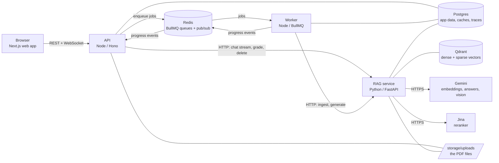
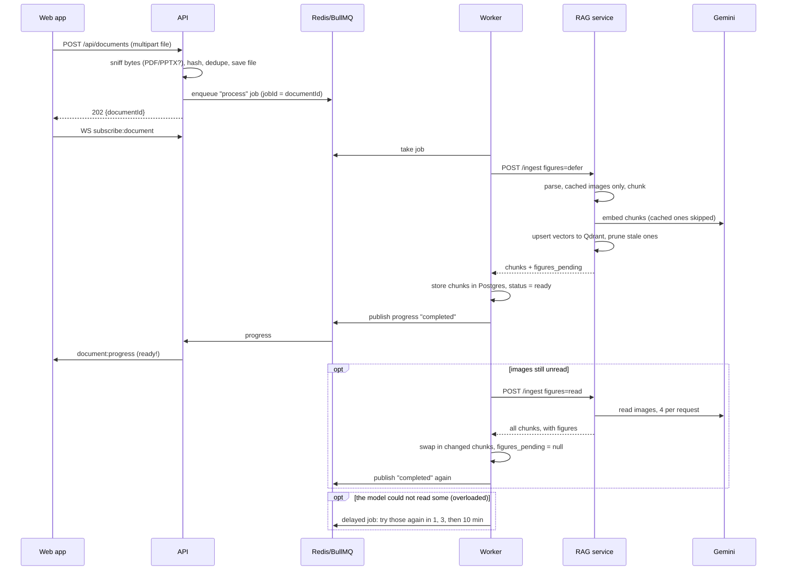
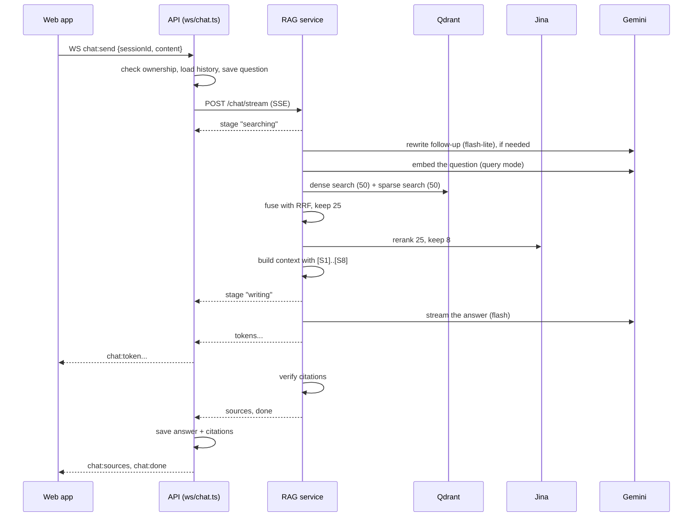

# How ExamPrep works

A guided tour of the whole system: what each piece is, why it was chosen, and
what actually happens -- step by step, service by service -- when a student
uploads a PDF, asks a question, takes a quiz and studies flashcards.

The one idea to keep in mind while reading: **every answer, question and card
must come from the student's own material, and say where it came from.** Almost
every design decision below exists to protect that, or to make it affordable on
free-tier AI services.

---

## Contents

1. [The system in one picture](#1-the-system-in-one-picture)
2. [The tech stack, and why each piece](#2-the-tech-stack-and-why-each-piece)
3. [Where data lives](#3-where-data-lives)
4. [Flow 1: starting a visit](#4-flow-1-starting-a-visit)
5. [Flow 2: uploading a document](#5-flow-2-uploading-a-document)
6. [Flow 3: asking a question](#6-flow-3-asking-a-question)
7. [Flow 4: a quiz](#7-flow-4-a-quiz)
8. [Flow 5: flashcards](#8-flow-5-flashcards)
9. [Flow 6: ending a visit](#9-flow-6-ending-a-visit)
10. [Living inside free tiers](#10-living-inside-free-tiers)
11. [Isolation and security](#11-isolation-and-security)
12. [Observability and evaluation](#12-observability-and-evaluation)
13. [Running and testing it](#13-running-and-testing-it)
14. [Glossary](#14-glossary)

---

## 1. The system in one picture



Four processes, three data stores, two outside AI services:

| Process | Language | What it owns |
| --- | --- | --- |
| **Web app** (`apps/web`) | TypeScript, Next.js 16, React 19 | Everything the student sees |
| **API** (`apps/api`) | TypeScript, Hono | Visits, ownership, REST, the WebSocket, starting jobs |
| **Worker** (`apps/worker`) | TypeScript, BullMQ | Long jobs: indexing documents, writing quizzes and cards |
| **RAG service** (`services/rag`) | Python, FastAPI | Everything that touches a document, a vector or a model |

The split is deliberate. **The Node side owns the product** -- who someone is,
what they may see, how messages travel. **The Python side owns the
intelligence** -- parsing, retrieval, generation. Python never learns who a
student is: it receives an opaque `user_id` and uses it only as a filter.

The browser only ever talks to the API. The API and worker talk to the RAG
service with a shared secret header (`x-internal-token`), so the RAG service is
never reachable from a browser.

---

## 2. The tech stack, and why each piece

### Front end

| Piece | Why |
| --- | --- |
| **Next.js 16 (App Router) + React 19** | Three pages (`/`, `/start`, `/study`), client-side state, and a fast dev loop. |
| **Plain inline styles + CSS tokens** (`src/styles/ds/tokens`) | A small hand-built design system (`src/ds`) instead of a CSS framework: one colour for all text, one spacing scale, one motion scale. |
| **A native WebSocket** (`src/lib/socket.tsx`) | Chat answers stream token by token, and upload/quiz progress is pushed live. |
| **lucide-react** | Icons. |

### API and worker

| Piece | Why |
| --- | --- |
| **Hono** | A small, fast web framework with typed routes and middleware. |
| **Zod** | Every request body, job and WebSocket message is validated against a schema -- and the same schemas live in `packages/shared`, so the API, worker and web app cannot disagree about a message's shape. |
| **Drizzle ORM** (`packages/db`) | Typed SQL and versioned migrations (`packages/db/drizzle/*.sql`). |
| **BullMQ on Redis** | A job queue with retries and backoff. Indexing a document or generating a quiz takes seconds to minutes, so it must not hold an HTTP request open. |
| **Redis pub/sub** | The worker publishes progress; the API forwards it to the right browser socket. |
| **jose (JWT)** | Short-lived signed access tokens. |
| **pino** | Structured logs. |

### RAG service

| Piece | Why |
| --- | --- |
| **FastAPI + Pydantic** | Typed endpoints, validation, and first-class async -- most work here is waiting on network calls. |
| **PyMuPDF** | Reads PDFs with layout: font sizes (to find headings), bounding boxes (to find tables), embedded images, and renders pages as pictures for scanned documents. |
| **python-pptx** | Reads slide decks, including speaker notes. |
| **Qdrant** | A vector database that stores a **dense** vector (meaning) and a **sparse** vector (keywords) on the same point, so hybrid search is one query per retriever over one corpus. |
| **Gemini `gemini-embedding-2`** (3072 dims) | Turns text into meaning-vectors. Separate "document" and "query" modes. |
| **BM25** (`app/retrieval/bm25.py`) | Keyword search with no model at all: tokenise, drop stopwords, stem (snowball), count. Qdrant computes IDF at query time. |
| **Jina `jina-reranker-v2-base-multilingual`** | Rereads the top candidates against the question and scores true relevance (a *calibrated* 0–1 score, which several honesty checks rely on). |
| **Gemini `gemini-3.8-flash`** | Writes answers, quiz questions and flashcards. |
| **Gemini `gemini-3.5-flash-lite`** | The cheap "utility" model: rewrites follow-up questions. |
| **Gemini `gemini-3.1-flash-lite`** | Reads images and scanned pages (vision). A model of its own so it has its own daily allowance. |
| **asyncpg** | The caches and the trace store write straight to Postgres. |

### Infrastructure

| Piece | Why |
| --- | --- |
| **Docker Compose** | Postgres 16, Redis 7 and Qdrant 1.12 with one command. |
| **`scripts/dev.mjs`** | Starts containers, builds shared packages, then runs all four processes with prefixed logs. |

**Why free tiers matter so much here:** Gemini's free tier allows roughly 20
generation requests a day *per model*. That single fact explains the caches,
the batching, the separate vision model, and most of section 10.

---

## 3. Where data lives

| Store | Holds | Deleted when |
| --- | --- | --- |
| **Postgres** | Users, visits (`login_sessions`), refresh tokens, documents, chunks (text + metadata), chats, messages, citations, tests, questions, attempts, flashcards, traces, the embedding cache, the vision cache | Everything a visit made goes when the visit ends. The two caches are kept on purpose (they hold no personal link). |
| **Qdrant** | One point per chunk: dense vector, sparse vector, and a payload (user id, document id, text, page, headings...) | When its document is removed. |
| **Disk** `storage/uploads/<userId>/<documentId>.pdf` | The uploaded file | When its document is removed; the folder when the visitor is. |
| **Redis** | Job queues, progress messages in flight | Jobs expire after a day (completed) or a week (failed). |

Chunks live in **both** Postgres and Qdrant on purpose: Qdrant owns the vectors
(for searching), Postgres owns the truth (for citations, the chunk viewer, and
re-indexing without re-parsing).

---

## 4. Flow 1: starting a visit

There are no accounts or passwords. A **visit** is a name and a workspace that
lasts until the student leaves.

1. The student types a name on `/start`. The web app calls
   `POST /api/auth/start` (`apps/api/src/routes/auth.ts`).
2. The API creates a **new user row every time** (two people typing "Sam" are
   two users -- a name must never unlock anything) and a `login_sessions` row:
   the visit.
3. It returns two tokens:
   - an **access token** -- a JWT signed with `JWT_ACCESS_SECRET`, valid 15
     minutes, carrying the user id (`sub`) and the visit id (`sid`);
   - a **refresh token** -- 32 random bytes, stored only as a SHA-256 hash,
     valid 30 days.
4. The web app keeps both in `localStorage` (`src/lib/api.ts`). Every request
   sends the access token; on a 401 it refreshes once (the refresh token is
   **rotated** -- the old one is revoked as the new one is issued, so a stolen
   refresh token works at most once).
5. The workspace opens a WebSocket to `/ws`. The **first frame must be**
   `{type: "auth", token}` -- a token in the URL would leak into logs. The hub
   answers `ready`.

Every authenticated request passes `requireAuth`
(`apps/api/src/middleware/auth.ts`), which verifies the JWT **and** checks the
visit has not ended -- so an ended visit's token stops working immediately, not
15 minutes later.

---

## 5. Flow 2: uploading a document

This is the most involved flow. The short version: the file is stored, a job
indexes its **text** first (the document is usable in seconds), and a second
pass adds anything that had to be **read from images**.



### 5.1 The API receives the file

`POST /api/documents` (`apps/api/src/routes/documents.ts`):

- **Sniffs the bytes** (`lib/file-type.ts`) -- the filename and content type are
  whatever the browser says; the first bytes of a PDF (`%PDF`) or a ZIP-based
  PPTX are not.
- **Hashes the file** (SHA-256). The same file twice in one visit is refused
  (`409`) -- unless the earlier copy **failed**, in which case the failed one is
  removed and the upload goes ahead.
- Inserts a `documents` row (`status = queued`), writes the file to
  `storage/uploads/<userId>/<documentId>.pdf`, and **enqueues a BullMQ job**
  whose id is the document id (3 attempts, exponential backoff).
- Returns `202` immediately. The student is not kept waiting on a request.

The browser subscribes to that document over the WebSocket; the hub checks the
document belongs to this visit before accepting.

### 5.2 The worker runs the job

`apps/worker/src/jobs/process-document.ts` runs **two passes**:

**Pass 1 -- text first (`figures: "defer"`).** Sets status `parsing`, calls the
RAG service's `/ingest`, stores the returned chunks, sets status `ready`, and
publishes `completed`. A text PDF is ready in a couple of seconds. The worker
records `figures_pending` = how many images are still unread.

**Pass 2 -- figures (`figures: "read"`), only if images are pending.** Publishes
a `figures` stage, calls `/ingest` again, and **swaps in** the chunks that
changed. The document stays `ready` and searchable throughout; a failure here
never fails the upload.

**Retries -- nothing is silently dropped.** An image the model could not read
(it answered "503, high demand", say) still counts as unread in
`figures_pending`, and for a scanned PDF each such image is a page. The worker
(`lib/figure-retries.ts`) queues a **delayed follow-up job** -- after 1, then 3,
then 10 minutes -- that reads only what is still missing; everything already
read comes from the vision cache. Delayed jobs rather than waiting inside this
one, so the worker is free for other uploads meanwhile. If the images still
cannot be read after the last try, or the day's quota is spent (retrying would
be refused the same way until it resets), the document records
`figures_unread`, and its tile says **"4 images unread"** with an explanation --
a scan with pages missing never passes for a complete one.

While a pass waits on the RAG service, the worker polls
`GET /documents/{id}/progress` every 2 seconds to report "reading pages 40%".

Storing chunks is an **update, not a replace** (`storeChunks`): delete only the
chunks that changed, renumber, upsert the rest -- inside one transaction. This
matters because a citation row points at a chunk and would be deleted with it.

### 5.3 The RAG service ingests

`POST /ingest` (`services/rag/app/api/ingest.py`) runs the pipeline in
`app/ingestion/pipeline.py`:

```
parse → read images → chunk → deduplicate → embed (dense) → encode (sparse) → index
```

**One run per document.** The run is its own task in a registry
(`app/ingestion/inflight.py`). If the worker times out and retries, the retry
*joins* the run still going instead of starting a second one. Deleting a
document cancels its run.

**Parse** (`app/parsing/pdf.py`, `pptx.py`). For each PDF page:
- text lines with their font size, boldness and position;
- tables (found by PyMuPDF's `find_tables`), written as `a | b | c` rows, and
  masked out of the prose so they are not extracted twice -- skipped on a page
  with no text layer, which can have no table to find;
- if the page has **under 60 characters of text** it is treated as **scanned**:
  the whole page is rendered at 150 DPI and queued for the vision model. It is
  encoded once -- JPEG (through Pillow, several times faster than PyMuPDF's own
  encoder) when raster images cover most of the page, PNG for a page drawn in
  vectors. A 15-page scan parses in about 1.3 s;
- otherwise its embedded images are extracted.

Heading levels are decided across the **whole** document from font sizes
(`app/parsing/structure.py`), and consecutive lines are merged into paragraphs
by measuring the document's normal line gap.

**Read images** (`app/ingestion/vision_enrichment.py`). Every image must earn
its API call:
1. **size** -- under 200×200 pixels is decoration;
2. **identity** -- the same logo on 60 slides is read once;
3. **cache** -- an image read before (by hash) is not read again
   (`vision_cache` table);
4. **budget** -- at most 40 new readings per document.

What remains is sent **4 images per request, 2 requests at a time**, with a
JSON schema so each answer is matched back to its image **by number**. The
model transcribes text and tables verbatim **and** describes every diagram in
2–3 sentences (on a line starting `Figure:`, with every label quoted) -- a
scanned page is usually both, and asking for one *or* the other is how a page
with a diagram beside its paragraphs used to lose the paragraphs. Decoration
gets `NO_CONTENT`. A spent daily quota, or two failed requests in a row (an
overloaded model), stops the pass; the text stays indexed, and whatever was
not read is reported as unread for the worker to try again (section 5.2).

In the deferred pass only the **cache** is used -- unless the document has no
text at all (a scanned PDF), which is read immediately, since there would be
nothing to search otherwise.

Every reading becomes `FIGURE` blocks marked `source = "vision"`. That mark
travels all the way to the citation: the student is told the text was *read
from an image*, never passed off as the document's own words.

On a **scanned page** the model also marks headings (`#`, `##`, `###`), and
those become real `HEADING` blocks -- the reading *is* the page, and without
them every chunk of a scanned document would be cited with no section. Two
guards keep them honest: a numbered heading takes its level from its number
("1.2.4" is level 3 on every page, whatever the model marked), and a caption
marked as a heading ("Table 1.3: …") stays text, so it cannot become the
section of every page after it. On a picture *inside* a page the document's
own typography sets the headings, so there the marks are dropped.

**Chunk** (`app/chunking/structural.py`). Blocks are grouped under their
heading trail ("Chapter 1 > 1.2 History > 1.2.3 Pharmacy Practice") and packed
into chunks of about **512 tokens** with **64 tokens of overlap** (whole
sentences). Tables, speaker notes and figures are kept whole, and only split
-- on row or line boundaries -- when one is over twice the chunk size. A chunk
under 64 tokens is merged into the next one when it sits under the same heading
or a parent of it.

A **page read from a scan starts its own chunk**: two short page readings would
otherwise be packed together and everything on the second cited as the first.
A chunk that still runs across a page break records its last page too
(`page_end`), and is cited as "pp.2–3" rather than just "p.2".

Each chunk's id is `uuid5(document_id, sha256(text))` -- the same text always
gets the same id, which is what makes re-ingesting cheap and gold sets stable.
Byte-identical chunks (a title slide repeated five times) are deduplicated.

**Embed** (`app/embedding/gemini.py`). The text embedded is not the bare chunk
but `"notes.pdf > Normalization > Third Normal Form\n\n<chunk text>"` -- so a
chunk that says "it must also satisfy 2NF" still carries its subject. Chunks go
64 per request, in `RETRIEVAL_DOCUMENT` mode. Every vector is cached in
Postgres by `(model, dimensions, sha256(text))` (`app/embedding/cache.py`), so
re-indexing the same text costs nothing.

**Encode (sparse).** The same text through BM25: stem each word, count, hash
into a sparse vector.

**Index** (`app/retrieval/qdrant_store.py`). Upsert every chunk as a point with
both vectors and a payload (user id, document id, text, page, headings,
source...), **then** delete this document's points that are no longer in the new
set. Upsert-then-prune means the document is never briefly empty.

The response hands every chunk back to the worker, which writes them to
Postgres (section 5.2).

---

## 6. Flow 3: asking a question



### 6.1 The API side

The web app sends `chat:send` over the WebSocket. `handleChat`
(`apps/api/src/ws/chat.ts`):

1. checks the chat session belongs to this visit;
2. loads the recent conversation;
3. works out the **search scope** -- the chat's one document, or every
   **ready** document in the visit (and if there are none, answers "nothing
   uploaded yet" without calling the RAG service at all);
4. saves the question, creates an empty assistant message (its id becomes the
   **correlation id** that ties every trace span of this answer together);
5. opens a streaming request to the RAG service and relays each event to the
   browser as it arrives: `chat:stage`, `chat:token`, `chat:sources`,
   `chat:done`;
6. saves the finished answer and its citations (so a reloaded page shows them).

### 6.2 The RAG side, stage by stage

`ChatService.stream` (`services/rag/app/generation/chat.py`):

**1. Whole-document questions.** "Summarise what I uploaded" or "what am I
likely to be tested on?" name no subject, so a search would find nothing. They
are recognised by wording (`app/generation/overview.py`) and answered from an
**even spread** of the whole document (up to 24 chunks / 12,000 tokens) instead
of a search. The prompt tells two kinds apart: a request for the *whole*
("summarise this") is covered part by part in document order; a request for a
*judgment* ("what is hardest?") picks one answer and says what it rests on.

**2. Condense.** A follow-up like "when did the clinical one begin?" cannot be
searched as is. With history present, a small model rewrites it into a
standalone question ("when did the clinical era of pharmacy practice begin?").
The rewrite is only for **searching** -- the model is later asked the question
the student actually typed. A local rule (`app/generation/history.py`) decides
whether it is needed at all. It always runs for a referring word ("how does
*it* work?"), a continuing opening ("and then?") or a question naming only an
aspect ("what are the advantages?"). A question that names its own subject
skips it -- unless that subject is what the last exchange was about ("when was
the college founded?" right after an answer about a college). Most follow-ups
now skip the call and its second or so of latency.

**3. Retrieve -- hybrid search** (`app/retrieval/retrievers.py`). Two searches
run **at the same time**:
- **dense**: the question embedded in `RETRIEVAL_QUERY` mode, nearest 50 chunks
  (`RETRIEVAL_DENSE_TOP_K`) by cosine similarity -- finds passages that *mean* the same thing in
  different words;
- **sparse (BM25)**: the question's stemmed keywords, best 50
  (`RETRIEVAL_SPARSE_TOP_K`) by BM25 --
  finds exact terms ("3NF", "GPAT", "D.Pharm") that meaning-vectors blur.

Every search is **filtered by user id and the document scope** inside Qdrant.

**4. Fuse -- Reciprocal Rank Fusion** (`app/retrieval/fusion.py`). The two
ranked lists are merged by rank, not score (their scores are on different
scales): each chunk scores `1/(60 + rank)` in each list, summed. Top 25 go on.

**5. Rerank** (`app/reranking/rerankers.py`). Jina reads each of the 25
candidates *together with* the question and gives a relevance score from 0 to
1. The best 8 are kept. Retrieving wide and reranking down gets better
material in front of the model than retrieving 8 directly.

**6. Off-topic check.** If both the best embedding similarity (< 0.55) and the
best reranker relevance (< 0.10) are low, the question is about something else
("what is the capital of France?"). It gets the "not in your material" reply
**without a model call**.

**7. Build the context** (`app/generation/context.py`). The chunks are written
out as numbered sources, within 5,000 tokens:

```
[S1] notes.pdf · pp.4–5 · Normalization › Third Normal Form
<text>

[S2] test 1.pdf · p.8 · History › 1.2.3 Pharmacy Practice · read from an image
<text>
```

**8. Generate.** The system prompt (`app/generation/prompts.py`) sets the
grounding rules: answer only from the sources, cite every claim with its
marker, never invent a marker or a page, and reply with the token
`NOT_SUPPORTED` when the material does not answer the question. The prior
turns go in as real conversation turns, capped at 8 turns / 1,500 tokens so
they can never crowd out the evidence. The answer **streams**; the first few
tokens are held back until it is clear the model is not refusing, so the
student never sees "NOT_SUPP..." flash up.

**9. Recheck a refusal.** If the model refuses but the reranker said the top
source was clearly relevant (≥ 0.2), the answer is regenerated once at
temperature 0 with a note that the sources were judged relevant. The rules are
unchanged -- a genuinely uncovered question is still refused.

**10. Verify citations.** Every marker in the answer is checked against the
sources actually supplied -- `[S1]`, and the grouped forms models also write:
`[S1, S3]`, `[S2; S4]`, `[S2-S4]`. Only sources the answer really cites are
returned; a marker pointing at nothing is reported, never rendered.

The web app (`src/components/answer.tsx`) turns markers into numbered chips
that show the document, page (or page range) and snippet -- one chip per
marker, grouped or not.

### 6.3 Why refusal is a feature

A student is better served by "your notes don't cover this" than by a fluent
answer from the model's own knowledge that won't match what they're examined
on. Three mechanisms protect this: the off-topic skip (no call at all), the
`NOT_SUPPORTED` token (a refusal the code can detect), and the recheck (so a
refusal against strong evidence gets one more look).

---

## 7. Flow 4: a quiz

1. **Setup.** In Quiz mode the student picks a document, a count (3–15) and a
   difficulty. The web app calls `POST /api/tests` with `types: ["mcq"]`.
2. **Queue.** The API checks the document is ready and in this visit, creates a
   `tests` row (`pending`), and enqueues a job on the study-generation queue.
3. **Generate** (`apps/worker/src/jobs/generate-study.ts` →
   `POST /generate/test` → `app/generation/exams.py`):
   - read every chunk of the document, drop scaffolding (references,
     contents, credits) and fragments;
   - cut the document into equal stretches and take a **random** chunk from
     each: still an even spread, but a new quiz is not the same quiz again;
   - prefer chunks no earlier quiz or card set on this document was written
     from (the worker passes their ids), falling back on used ones only when
     the fresh ones run out;
   - send batches of 6 labelled passages (`[C1]..[C6]`) to the model with a JSON
     schema;
   - **every question must name the passage it came from.** A question naming a
     label that was not in its batch is discarded -- it cannot be traced to the
     material. So is an MCQ whose answer is not among its options.
   - The correct answer is stored as an **option index**, not text.
4. **Ready.** The worker saves the questions and publishes `ready`; the web app
   loads the paper. The answer key is **not** sent -- `GET /api/tests/:id`
   withholds correct answers and explanations.
5. **Grade.** On submit, `POST /api/tests/attempts/:id/submit` sends answers to
   the RAG service's `/grade`. Multiple choice and true/false are compared
   exactly with **no model call**; short answers (the console can request
   them) are judged by the model in one batched call with partial credit. The
   results, correct answers and source-backed explanations are returned only
   now. The attempt is **claimed** with one conditional update before grading
   (`in_progress` → `submitted`), so of two submits racing each other exactly
   one grades; a grading failure hands the attempt back. A graded attempt
   cannot be resubmitted.

---

## 8. Flow 5: flashcards

Same shape as the quiz (`POST /api/flashcards` → job → `/generate/flashcards`
→ `app/generation/flashcards.py`), with three differences:

- cards must be short (an answer over a set length is discarded -- a card that
  is a paragraph can't be recalled in a few seconds);
- duplicate fronts are dropped;
- models tend to under-deliver ("asked for four, wrote two"), so **one top-up
  call** goes over the least-used passages to recover the shortfall.

Both sides of a card are returned together -- turning it over is the whole
interaction. The study view (`src/components/cards-panel.tsx`) flips on click
and moves with the arrow keys.

---

## 9. Flow 6: ending a visit

Pressing **End session** calls `POST /api/auth/logout`
(`apps/api/src/lib/login-sessions.ts`):

1. the visit is marked **ended first** -- its tokens stop working at once, even
   if cleanup then fails;
2. every document is removed through one path (`lib/document-removal.ts`):
   cancel a queued job → delete its vectors in Qdrant (if this fails, the row
   stays so the removal can be retried) → delete the file → delete the row;
3. the visit row is deleted; chats, messages, quizzes, cards and refresh
   tokens **cascade** with it;
4. the user row is deleted (traces cascade with it), then the upload folder.

A student who just closes the tab is handled by the **sweeper**: every 10
minutes the API clears visits that ended, or that no longer hold a usable
refresh token (30 days unused).

---

## 10. Living inside free tiers

Roughly 20 generation requests per model per day is the binding constraint.
What keeps the app working inside it:

| Technique | Where | Effect |
| --- | --- | --- |
| **Separate models per job** | `config.py` | Answers, rewrites and vision each draw on their own daily allowance. |
| **Embedding cache** | `embedding/cache.py` | The same text is never embedded twice. |
| **Vision cache** | `vision/cache.py` | The same image is never read twice -- across retries and across students. |
| **Batching** | vision (4/request), embeddings (64/request), quiz/cards (6 passages/request) | Fewer requests for the same work. |
| **Client-side rate limiters** | `embedding/rate_limit.py` | A token bucket per provider keeps under the per-minute limit instead of hitting it. |
| **Retry with jittered backoff** | same | Per-minute 429s and 5xx errors are retried, honouring the server's `retryDelay`. |
| **Daily-quota detection** | `core/gemini.py` | A per-*day* 429 is recognised and stops the work at once instead of retrying for minutes. |
| **Off-topic skip** | `generation/chat.py` | Obviously unrelated questions cost no model call. |
| **Rewrite only when needed** | `generation/history.py` | A follow-up that names its own subject skips the rewrite call. |
| **Text first, figures after** | worker + pipeline | The slow, quota-heavy part never blocks the student. |
| **One run per document** | `ingestion/inflight.py` | A retry never doubles the work. |

---

## 11. Isolation and security

- **The browser never reaches the RAG service.** It needs the internal token,
  which only the API and worker hold.
- **Every query is scoped by visit.** Documents, chats, tests and cards are
  looked up with `login_session_id = <the token's visit>`; someone else's id
  returns `404`, the same as a missing one (a different answer would confirm it
  exists).
- **Vectors are filtered by user id inside Qdrant** -- the isolation boundary on
  the Python side.
- **The WebSocket checks ownership** before relaying any progress.
- **Uploaded files are identified by their bytes**, not their name, before a
  parser ever sees them; storage keys are checked against path traversal.
- **Refresh tokens are stored hashed and rotated**; access tokens last 15
  minutes and die with the visit.
- **API keys travel in headers**, never in URLs where they would be logged.

---

## 12. Observability and evaluation

**Tracing.** Every pipeline request in the RAG service is a trace: rewrite,
retrieval scores, fusion overlap, rerank movement, context size, generation
time, cited markers (`app/observability`). Spans go to the `traces` table
(and optionally Langfuse). A trace is filed under the id of what it produced --
a chat answer's message id, a document's id, a test or flashcard set's id, an
attempt's id -- and under the visit's user, so it is deleted with the visit. So
`GET /api/traces/<messageId>` shows exactly what happened for that answer, and
`GET /api/traces/<testId>` how that quiz was made. The dev console's **Traces**
tab shows latency and errors by stage.

**When a dependency is down.** If the API cannot reach Postgres, Redis or the
RAG service at all, it answers `503 service_unavailable` with "Nothing you
uploaded has been lost" rather than a bare 500. The workspace never claims
"nothing uploaded yet" or "0 documents" about a list it could not load; it
says the server is unreachable and keeps asking every 5 seconds, so it comes
back by itself when the server does.

**The dev console** (`http://localhost:3001/console`, development only)
exercises the pipeline piece by piece -- including a **retrieval lab** that runs
one question through BM25, dense, hybrid and hybrid+rerank side by side, which
is the fastest way to tell a retrieval problem from a generation problem.

**Evaluation.** `services/rag/scripts/evaluate.py` compares the four strategies
on a gold set of questions with known answers: Recall@K, Precision@K, MRR,
NDCG@K and hit rate, with a paired bootstrap and a sign test for every
difference. Results are in `docs/evaluation-baseline.md`.

---

## 13. Running and testing it

```bash
npm install
cp .env.example .env          # add GEMINI_API_KEY (and JINA_API_KEY)
npm run infra:up              # Postgres, Redis, Qdrant
npm run db:migrate
npm run dev                   # everything, with prefixed logs
```

The web app is at `http://localhost:3000`, the dev console at
`http://localhost:3001/console`.

Tests need no API key -- the RAG suite runs on stand-in providers and a
throwaway Qdrant collection:

```bash
npm test                                            # API, worker
cd services/rag && .venv/Scripts/python.exe -m pytest -q
```

`services/rag/tests/test_contract.py` reads the TypeScript source and checks it
against the Python models, so the two sides cannot drift apart silently.

---

## 14. Glossary

| Term | Meaning |
| --- | --- |
| **RAG** | Retrieval-augmented generation: find relevant passages first, then have the model answer *from them*. |
| **Chunk** | A retrievable piece of a document, ~512 tokens, with its page and heading trail. |
| **Embedding / dense vector** | A list of 3072 numbers capturing a text's meaning; similar meanings are close together. |
| **Sparse vector / BM25** | A keyword score: rare words matter more, repeated words matter less and less. |
| **Hybrid search** | Dense and sparse together, because each finds what the other misses. |
| **RRF** | Reciprocal Rank Fusion: merging ranked lists by position rather than score. |
| **Reranker** | A model that reads question and passage together to judge relevance precisely. |
| **Context** | The numbered sources the answering model is allowed to use. |
| **Grounding** | Answering only from supplied sources, with a citation for each claim. |
| **Visit** | One start-to-end use of the app; everything made in it is deleted with it. |
| **Correlation id** | The id that ties every log and trace of one operation together. |
| **Figure / vision reading** | Text a model read out of an image; always labelled as such. |
